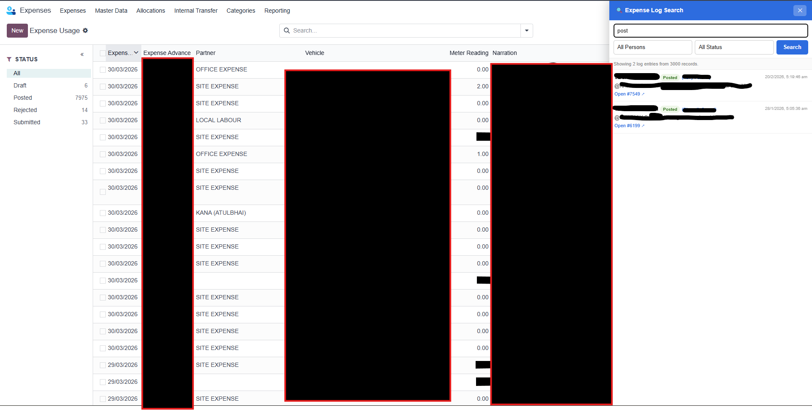
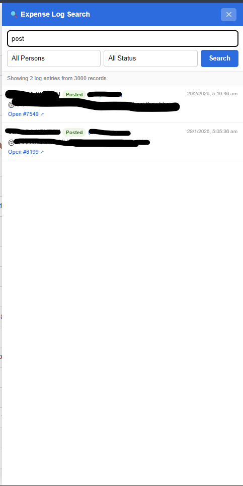
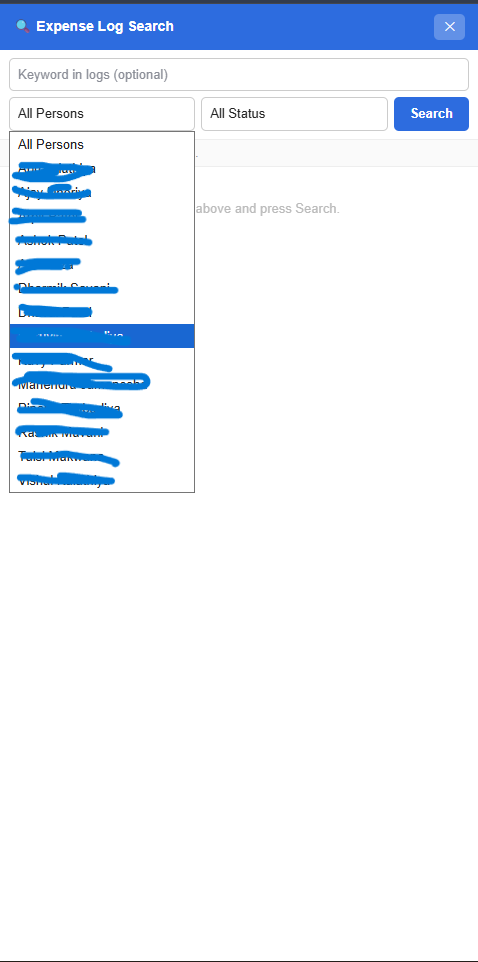
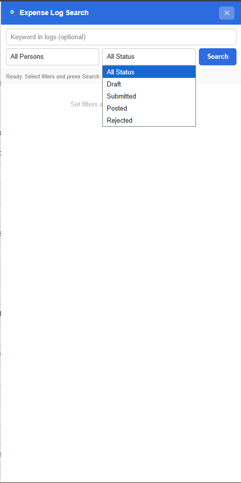

# 📸 Screenshots & Demos

## 1. Bookmarklet in Action

### Bookmarklet Overview


Shows the complete bookmarklet interface in action on your Odoo Expense page.

### Main Panel - Filter View


Shows the bookmarklet appears as a clean right-side panel on your Odoo Expense page. Shows:
- **Blue header** with title "Expense Log Search" + close button (✕)
- **Person dropdown** — auto-populated with 15+ employees from your system
- **Status dropdown** — All Status / Draft / Submitted / Posted / Rejected
- **Keyword input** — optional text search in activity logs
- **Search button** — blue CTA to execute the search
- **Info area** — shows status ("Ready. Select filters and press Search")



---

## 2. Status Filter Options

### Status Dropdown Expanded

```
All Status          (selected - shows all)
Draft              (expenses not yet submitted)
Submitted          (pending approval)
Posted             (approved & posted)
Rejected           (rejected, needs revision)
```

---

## 3. Example Search Results

### Search Scenario: Find all rejected expenses from Ashok Patel

**Filters applied:**
- Person: `Ashok Patel`
- Status: `Rejected`
- Keyword: *(empty)*

**Expected results:**
- Multiple log entries showing rejection reasons
- Each entry displays:
  - ✓ Employee name (Ashok Patel)
  - 🔴 Status badge (Rejected)
  - Date/Time of log entry
  - Message preview (e.g., "Budget limit exceeded")
  - Clickable link to open full record

---

## How to Add Screenshots

Screenshots are stored in the `docs/` folder with descriptive names:

**Current screenshots:**
- `docs/bookmarklet-overview.png` — Full bookmarklet interface view
- `docs/all-persons-filter.png` — Employee/Person dropdown
- `docs/status-filter.png` — Status filter options
- `docs/search-feature.png` — Search feature in action
- `docs/odoo-integration-full-page.png` — Full page integration (optional)

**To update or add screenshots:**
1. Take new screenshots of the bookmarklet
2. Save them to the `docs/` folder with descriptive names
3. Update the references in this file
4. Commit and push:
   ```
   git add docs/
   git commit -m "Update screenshots with latest images"
   git push
   ```

---

## UI Elements Visualization

### Color Scheme
| Element | Color | Hex |
|---------|-------|-----|
| Header & Button | Blue | `#2d6cdf` |
| Posted Badge | Green | `#2d6d1a` (bg: `#eef6e8`) |
| Rejected Badge | Red | `#a32d2d` (bg: `#fce8e8`) |
| Log Badge | Amber | `#8a6000` (bg: `#fef5e0`) |
| Text | Dark Gray | `#222` |
| Border | Light Gray | `#eee` |

---

## Mobile Responsiveness

⚠️ **Currently NOT mobile-optimized:**
- Fixed 480px width panel
- Best on desktop (1024px+ screens)
- May overlap on tablets
- Not tested on mobile

---

## Browser Compatibility

✅ **Tested & Working:**
- Chrome 120+
- Edge 120+
- Firefox 121+
- Safari 17+

✅ **Features:**
- JavaScript ES6+ (no transpilation needed)
- Fetch API
- DOM manipulation
- Sessionless (uses browser cookies)

---

## Live Demo

**URL:** https://yourodoo.instance.com/odoo/expense-usage  
**Steps:**
1. Click the `Expense Log Search` bookmark
2. Panel appears on right
3. Select Person: `Ashok Patel`
4. Select Status: `Rejected`
5. Click **Search**
6. See all log entries in seconds

---

## Video Demo

*Coming soon: Short GIF showing the search workflow*

